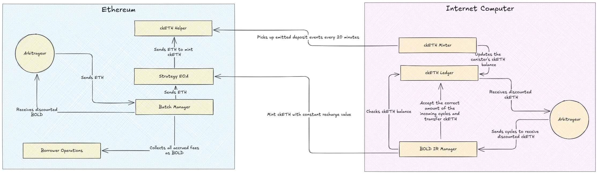
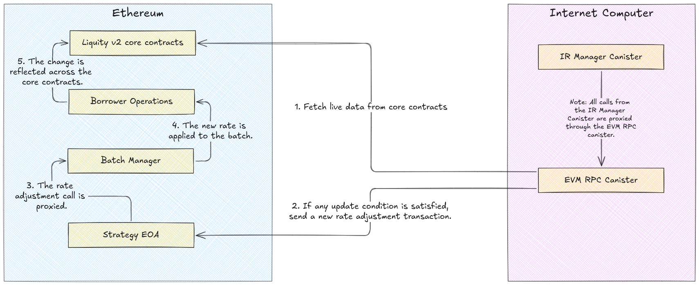
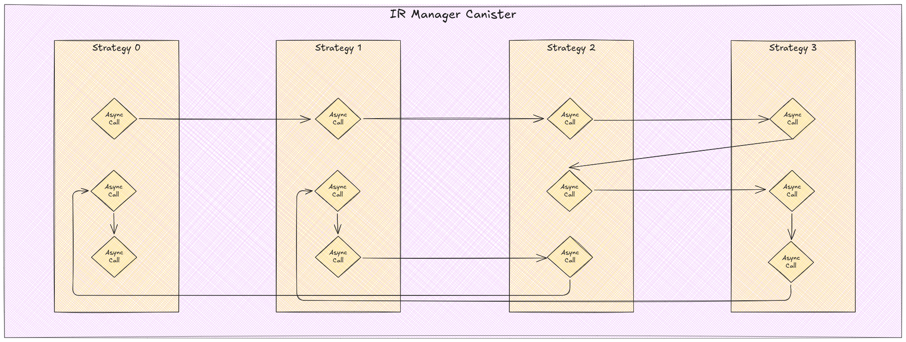

# BOLD Interest Rate Manager

## Overview

The BOLD Interest Rate (IR) Manager is an Internet Computer canister that orchestrates automated interest rate adjustments for Liquity V2's trove system. Implemented in Rust, it utilizes threshold ECDSA signatures to manage multiple EOAs on Ethereum, enabling secure rate adjustments through batch manager contracts.

The system employs a multi-strategy approach where each strategy encapsulates rate management logic for a specific trove subset. These strategies operate autonomously through a cyclic execution model, evaluating rate adjustment conditions hourly while maintaining safeguards against concurrent modifications.

## Calculations

In Liquity V2, borrowers incur the following fees:

- [Interest rate](https://github.com/liquity/bold/blob/main/README.md#borrowing-and-interest-rates): a recurrent rate set by the borrower and charged on their current debt
- [Premature adjustment fee](https://github.com/liquity/bold/blob/main/README.md#premature-adjustment-fees): a one-off fee corresponding to 1 week of the average interest rate of the respective collateral market, charged on the debt whenever the borrower adjusts their interest rate within less than 7 days since the last adjustment ("cooling off period"). The same fee is charged when a new Trove is opened or when its debt is increased ([see](https://github.com/liquity/bold/blob/main/README.md#upfront-borrowing-fees))

> [!NOTE]
> In addition to these fees, borrowers delegating to a batch manager may also be charged a management fee. [see](https://github.com/liquity/bold/blob/main/README.md#batch-management-fee)!

An optimal interest rate strategy should minimize the costs of borrowing by striking a balance between the interest rate and its adjustment frequency as well as the redemption risk ([see](https://github.com/liquity/bold/blob/main/README.md#bold-redemptions) on redemptions in Liquity V2).

The autonomous management system targets a specific debt percentage to be in front (i.e. to be redeemed first) of all the Troves participating in the strategy. To determine the debt in front, the system calculates the percentage of redemptions hitting the respective collateral branch and uses it to loop over the list of Troves in the branch, ordered by interest rate from lowest to highest.

### Key Terms and Parameters

- $d$: Debt that needs to be redeemed first until you are hit.
- $f$: Redemption fee.
- $D_{\min}$: Minimum target debt (e.g., 5\%).
- $M_u$, $M_d$: Tolerance margins for upward and downward deviations (e.g., 0.25).
- $T_d$: Upfront fee period in time steps (e.g., 7 days).
- $t$: Number of time steps since the last update.
- $r_{\text{curr}}$, $r_{\text{new}}$, $r_{\text{avg}}$: Current, new, and average interest rates.

The base debt $D_{\min}$ is a parameter preset for each strategy and determines the target range for the debt in front, along with tolerance margins for up and down deviations ($M_u$ and $M_d$) defined as system-wide constants. The system thus aims to adjust the interest rate to achieve the midpoint of the target range when the debt in front gets out of range, by increasing or decreasing the rate as needed.

The system employs the following mathematical foundations for its decisions:

$$
d < (1 - M_d) \cdot \text{TargetAmount}
$$

When the debt in front becomes larger than the upper bound of the target range, the interest rate is adjusted if both of these conditions hold:

$$
d > (1 + M_u) \cdot \text{TargetAmount}
$$
$$
\left( 1 - \frac{t}{T} \right) (r_{\text{curr}} - r_{\text{new}}) > r_{\text{avg}} \quad \lor \quad t > T
$$

The second condition minimizes premature adjustment costs by only reducing rates when either the last adjustment was more than seven days ago or when the potential savings exceed the adjustment fee. The adjustment fee equals the size-weighted average interest paid by all borrowers in the same collateral branch.

The new interest rate calculation aims to achieve a debt in front corresponding to the target range's midpoint:

$$
r_{\text{new}} = \text{calculateRate}(F) + \text{1 bip}
$$

### Target Percentage and Amount

The **TargetPercentage** is defined as:

$$
\text{TargetPercentage} = 2 D_{\min} \cdot \frac{\frac{f}{0.005}}{1 + \frac{f}{0.005}}
$$

The **TargetAmount** is defined as:

$$
\text{TargetAmount} = \text{TargetPercentage} \cdot \text{MaximumRedeemableAgainstCollateral}
$$

### Maximum Redeemable Against Collateral

The maximum redeemable amount is calculated as:

$$
\text{MaximumRedeemableAgainstCollateral} = \left( \frac{\text{UnbackedPortion}}{\text{TotalUnbacked}} \right) \cdot \text{TotalDebt}
$$

## Core Architecture

### Strategy Implementation

The system implements a two-tier strategy architecture:

1. **StableStrategy**: The persistent strategy representation stored in stable memory. It maintains immutable settings, mutable state data, and locking metadata. This tier ensures strategy persistence across canister upgrades.

2. **ExecutableStrategy**: A runtime wrapper that implements the strategy execution logic. Created transiently from StableStrategy instances, it handles rate calculations, transaction preparation, and state updates. The executable strategy automatically releases locks through Rust's Drop trait implementation.

### Locking Mechanism

The system implements two distinct locking mechanisms for atomic operations:

1. **Strategy Lock**: A timeout-based lock that prevents concurrent strategy execution. It includes:
   - Automatic timeout after 3600 seconds
   - Last locked timestamp tracking
   - Deadlock prevention through timeout-based force unlocking
   - Automatic release through Rust's Drop trait

2. **Swap Lock**: A dedicated lock for ckETH<>Cycles arbitrage operations. Features:
   - Atomic swap operation protection
   - Automatic cleanup on scope exit
   - Transaction rollback on failure

### Halting System

The canister implements a progressive halting mechanism that monitors system health through multiple metrics:

1. **Monitoring Conditions**:
   - Strategy execution success rates over 7-day periods
   - Rate adjustment frequency over 90-day windows
   - Overall system activity levels

2. **Halting States**:
   - Functional: Normal operation
   - HaltingInProgress: 7-day warning period before full halt
   - Halted: Complete system shutdown

When halt conditions are met, the system enters a 7-day grace period before permanent halting. This provides time for external observers to react while preventing abrupt system termination.

## Autonomous Operation

### Strategy Execution Cycle

Each strategy operates on an hourly execution cycle that:

1. **State Assessment**:
   - Retrieves current trove positions
   - Calculates system-wide debt metrics
   - Evaluates redemption fees
   - Determines debt-in-front positions

2. **Rate Calculation**:
   - Computes target debt ranges
   - Applies tolerance margins
   - Determines optimal rate adjustments
   - Estimates transaction fees

3. **Transaction Management**:
   - Implements automatic retry logic for failed transactions
   - Manages nonce synchronization across EOAs
   - Handles gas estimation and fee optimization
   - Monitors transaction confirmations

### Recharge System

The system maintains operational capacity through an autonomous recharge mechanism:

1. **ckETH Management**:
   - Monitors balance against 100T unit threshold
   - Triggers automatic minting when below threshold
   - Implements 3% discount rate for cycle swaps
   - Enforces minimum 10T cycles for swap operations

2. **EOA Rotation**:
   - Cycles through available EOAs for minting operations
   - Tracks successful operations per EOA
   - Maintains nonce synchronization
   - Implements failure recovery mechanisms

## Rate Adjustment Logic

The rate adjustment process follows a precise analytical framework:

## Concurrency Management

The system implements deterministic concurrency control through:

1. **Strategy Isolation**:
   - Independent execution contexts per strategy
   - State partitioning across strategies
   - Resource allocation controls
   - Cross-strategy coordination mechanisms

2. **Provider Management**:
   - Reputation-based provider selection
   - Automatic provider rotation
   - Consensus-driven multi-provider requests
   - Dynamic response size adjustment

## Transaction Security

The system implements robust transaction security through:

1. **Signature Generation**:
   - tECDSA signature generation for all transactions
   - Deterministic nonce management
   - Transaction replay protection
   - Gas optimization algorithms

2. **State Protection**:
   - Atomic state updates with rollback
   - Strategy state version tracking
   - Resource consumption limits
   - Overflow protection mechanisms

## System Recovery

The system implements multiple recovery mechanisms:

1. **Transaction Recovery**:
   - Automatic retry with exponential backoff
   - Nonce synchronization on failure
   - Gas price adjustment for stuck transactions
   - Maximum retry thresholds

2. **Provider Recovery**:
   - Automatic failover on provider errors
   - Response size adjustment for large requests
   - Consensus requirement relaxation under stress
   - Provider reputation tracking

3. **State Recovery**:
   - Journal-based state reconstruction
   - Automatic log rotation
   - Strategy state verification
   - Timeout-based lock recovery

## Deployment Architecture

The system is designed for immutable deployment:

1. **Initialization**:
   - One-time strategy configuration
   - Initial EOA setup
   - Provider configuration
   - System parameter initialization

2. **Blackholing**:
   - Controller removal after initialization
   - Immutable strategy logic
   - Fixed system parameters
   - Permanent autonomy establishment

The combination of these mechanisms ensures the system operates autonomously while maintaining security and reliability. The progressive halting system provides a safety net against systemic failures, while the automatic retry and recovery mechanisms handle transient issues.
